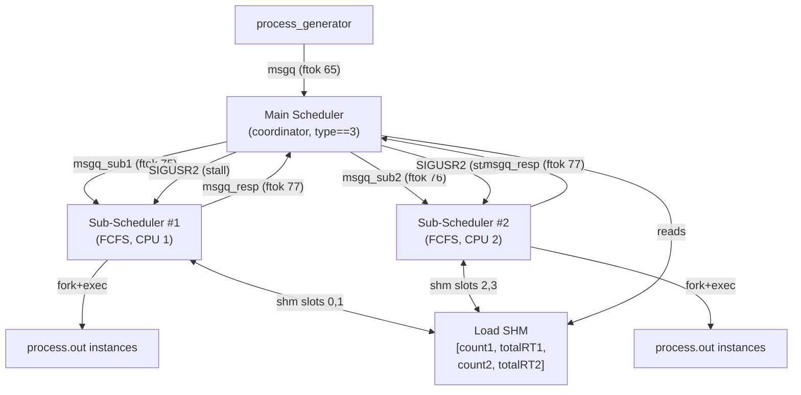
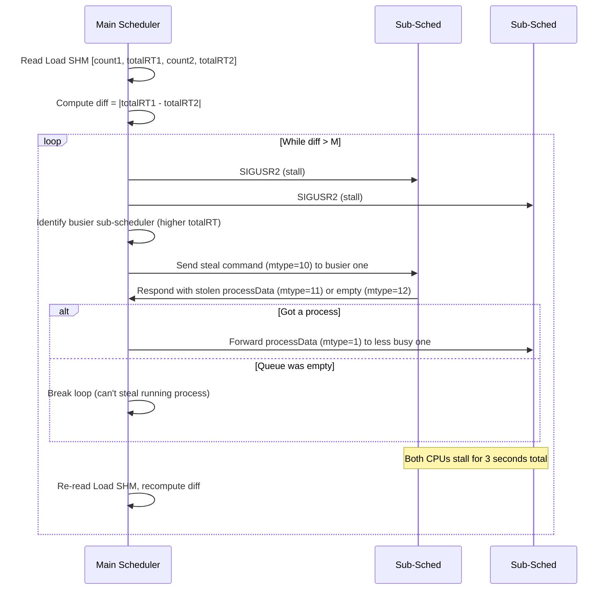

# 2-CPU FCFS Scheduler with Process Stealing

## Background

Implement a 2-CPU architecture where the main scheduler acts as a **coordinator** that
routes incoming processes to two independent FCFS sub-schedulers, and performs load-balancing
(process stealing) every N clock ticks.

## Architecture Overview



---

## IPC Resource Layout

| Resource | Key | Size | Purpose |
|----------|-----|------|---------|
| msgq (existing) | `ftok("../keyfile", 65)` | — | process_generator → main scheduler |
| msgq_sub1 (**new**) | `ftok("../keyfile", 75)` | — | main scheduler → sub-scheduler #1 |
| msgq_sub2 (**new**) | `ftok("../keyfile", 76)` | — | main scheduler → sub-scheduler #2 |
| msgq_response (**new**) | `ftok("../keyfile", 77)` | — | sub-schedulers → main scheduler (steal responses) |
| Load SHM (**new**) | `ftok("../keyfile", 80)` | 4 × `int` | `[count1, totalRT1, count2, totalRT2]` |
| Tick semaphore #1 (**new**) | `ftok("../keyfile", 81)` | 1 | Sub-scheduler #1's tick gate for its running process |
| Tick semaphore #2 (**new**) | `ftok("../keyfile", 82)` | 1 | Sub-scheduler #2's tick gate for its running process |
| shmRT #1 (**new**) | `ftok("../keyfile", 83)` | 1 × `int` | Sub-scheduler #1 ↔ its running process remaining time |
| shmRT #2 (**new**) | `ftok("../keyfile", 84)` | 1 × `int` | Sub-scheduler #2 ↔ its running process remaining time |

> [!NOTE]
> The existing `ftok 66` (semaphore) and `ftok 70` (shmRT) are still used by RR/HPF (types 1 & 2). The 2-CPU mode uses its own keys (81–84) so the two modes don't collide.

### Message Types (mtype)

| mtype | Direction | Meaning |
|-------|-----------|---------|
| 1 | main → sub | New process assignment (processData payload) |
| 5 | main → sub | Termination signal (no more processes) |
| 10 | main → sub | Steal command: "remove your rear process and send it back" |
| 11 | sub → main | Steal response: processData of the stolen process |
| 12 | sub → main | Steal response: "queue is empty, nothing to steal" |

---

## Process Routing (New Arrivals)

When the main scheduler receives a process from process_generator:

1. Read `count1` and `count2` from Load SHM
2. If `count1 <= count2` → send to sub-scheduler #1's msgq
3. Else → send to sub-scheduler #2's msgq

> [!IMPORTANT]
> `count` includes **both** queued processes and the currently running process (if any). This matches the spec: "Select the queue with the least number of processes."

---

## Steal Protocol (Every N Ticks)



### Stall Mechanism (3-Second Overhead)

When a sub-scheduler receives `SIGUSR2`:
1. Sets `stalled = 1` and records `stall_end_time = getClk() + 3`
2. While stalled, the sub-scheduler **does NOT** call `up(sem_id)` (the running process freezes — no CPU ticks consumed)
3. The sub-scheduler **continues its main loop** to process msgq messages (steal commands, new arrivals)
4. When `getClk() >= stall_end_time`, sets `stalled = 0`, resumes normal ticking

> [!WARNING]
> A new process arriving during the stall **is still handled normally** — it gets enqueued into one of the sub-schedulers. Only CPU execution (ticking) is paused.

### What Gets Stolen

- **Steal from**: the **rear** (last) process in the `readyQueue` of the busier sub-scheduler
- **Cannot steal**: the currently running process (`currProcess`) — it's not in the queue
- If `readyQueue` is empty (all workload is in the running process), sub-scheduler responds with mtype=12, and the steal loop breaks

### Stolen Process State

Since FCFS never preempts, every process in `readyQueue` is in waiting state (`pid == -1`, never forked). So stealing is simply:
1. Busier sub-scheduler: `dequeue_rear()` → convert PCB back to `processData` → send via msgq
2. Less busy sub-scheduler: receive `processData` → `createPCB()` → `enqueue()`

No process stopping/migration needed.

---

## Proposed Changes

### Data Structure Layer

#### [MODIFY] [Sch_PCB.h](file:///wsl.localhost/Ubuntu-24.04/home/emad/os/CPU-scheduler/data_structures/PCB/Sch_PCB.h)
- Add declaration: `PCB *dequeue_rear(Queue *q);`

#### [MODIFY] [Sch_PCB.c](file:///wsl.localhost/Ubuntu-24.04/home/emad/os/CPU-scheduler/data_structures/PCB/Sch_PCB.c)
- Implement `dequeue_rear()`: traverses the singly-linked list to find the second-to-last node, removes the rear node, updates `q->rear` pointer. O(n) — acceptable for this project.

```c
PCB *dequeue_rear(Queue *q)
{
    if (isEmpty(q)) {
        return NULL;  // nothing to steal
    }
    // Single element
    if (q->front == q->rear) {
        PCB *p = q->front->pcb;
        free(q->front);
        q->front = q->rear = NULL;
        q->size--;
        return p;
    }
    // Find second-to-last
    Node *curr = q->front;
    while (curr->next != q->rear)
        curr = curr->next;
    PCB *p = q->rear->pcb;
    free(q->rear);
    q->rear = curr;
    q->rear->next = NULL;
    q->size--;
    return p;
}
```

---

### Process Layer

#### [MODIFY] [process.c](file:///wsl.localhost/Ubuntu-24.04/home/emad/os/CPU-scheduler/process/process.c)
- Accept **2 additional optional command-line arguments**: `sem_proj_id` and `shmRT_proj_id` (the `ftok` project IDs)
- If provided (argc >= 4), use them instead of hardcoded 66 and 70
- This keeps backward compatibility with RR/HPF (argc == 2)

```diff
-    int sem_id = semget(ftok("../keyfile", 66), 1, 0666);
+    int sem_proj = 66;  // default for RR/HPF
+    int shmRT_proj = 70;
+    if (argc >= 4) {
+        to_int(argv[2], &sem_proj);
+        to_int(argv[3], &shmRT_proj);
+    }
+    int sem_id = semget(ftok("../keyfile", sem_proj), 1, 0666);
     ...
-    int shmRT_id = shmget(ftok("../keyfile", 70), 4, 0666);
+    int shmRT_id = shmget(ftok("../keyfile", shmRT_proj), 4, 0666);
```

---

### Sub-Scheduler (New)

#### [NEW] [sub_scheduler.c](file:///wsl.localhost/Ubuntu-24.04/home/emad/os/CPU-scheduler/scheduler/sub_scheduler.c)

A standalone executable that runs FCFS for one CPU. Arguments: `<cpu_id> <sem_proj_id> <shmRT_proj_id> <msgq_sub_key_proj> <msgq_resp_key_proj> <load_shm_key_proj>`

**Responsibilities**:
1. Attach to its dedicated msgq (receives processes + steal commands from main scheduler)
2. Create its own semaphore (tick gate) and shmRT (remaining time communication with process.out)
3. Run FCFS main loop:
   - Receive new processes (mtype=1) → `createPCB()` → `enqueue()`
   - Receive steal commands (mtype=10) → `dequeue_rear()` → send back processData (mtype=11/12) via response msgq
   - If `currProcess == NULL && !isEmpty(readyQueue)` → dequeue front, `runProcess()`
   - Tick the running process: `up(sem_id)` (unless stalled)
   - Handle `SIGUSR1` (process finished) the same way as current scheduler
   - Handle `SIGUSR2` (stall): set stall flag, skip ticking for 3 seconds
4. Update Load SHM every tick:
   - `count = readyQueue->size + (currProcess != NULL ? 1 : 0)`
   - `totalRT = total_remaining_time(readyQueue) + (currProcess != NULL ? *shmRT_addr : 0)`
5. On mtype=5 (termination): stop accepting new processes, finish current work, exit

**Key difference from current scheduler.c**: This file does NOT receive from the process_generator msgq. It only receives from its own dedicated msgq.

#### [NEW] [sub_scheduler.h](file:///wsl.localhost/Ubuntu-24.04/home/emad/os/CPU-scheduler/scheduler/sub_scheduler.h)
- Header file with sub-scheduler declarations

---

### Main Scheduler (Coordinator Mode)

#### [MODIFY] [scheduler.c](file:///wsl.localhost/Ubuntu-24.04/home/emad/os/CPU-scheduler/scheduler/scheduler.c)

For `type == 3`, the main scheduler becomes a **coordinator** (no direct process execution):

1. **Initialization**:
   - Create IPC resources: msgq_sub1, msgq_sub2, msgq_response, Load SHM
   - Fork+exec two `sub_scheduler.out` processes with appropriate arguments
   - Track their PIDs: `sub1_pid`, `sub2_pid`

2. **Main loop** (tick-based):
   - Receive processes from process_generator msgq (existing)
   - Read Load SHM → route each process to the sub-scheduler with fewer processes (tie → #1)
   - Forward process via `msgsnd()` on the appropriate sub-scheduler's msgq
   - Every N ticks: perform the **steal loop** (read Load SHM, check |totalRT1 - totalRT2| > M, steal if needed)
   - On mtype=5 from process_generator: forward to both sub-schedulers, wait for them to exit

3. **Cleanup**: wait for both sub-scheduler PIDs, remove all IPC resources

> [!IMPORTANT]
> The coordinator does NOT fork process.out, does NOT manage semaphores for processes, and does NOT handle SIGUSR1 from processes. It only does routing and load balancing.

#### [MODIFY] [scheduler_functions.c](file:///wsl.localhost/Ubuntu-24.04/home/emad/os/CPU-scheduler/scheduler/scheduler_functions.c)
- The existing `FCFS_algo()` function can be removed or kept as-is (it's now unused for type==3; the sub-scheduler handles FCFS internally)
- Add helper function: `processData pcb_to_processData(PCB *pcb)` — converts PCB back to processData for message passing

#### [MODIFY] [scheduler.h](file:///wsl.localhost/Ubuntu-24.04/home/emad/os/CPU-scheduler/scheduler/scheduler.h)
- Add new declarations as needed

---

### Build System

#### [MODIFY] [Makefile](file:///wsl.localhost/Ubuntu-24.04/home/emad/os/CPU-scheduler/Makefile)
- Add `SUB_SCHEDULER_SRCS` and `SUB_SCHEDULER_BIN` variables
- Add `sub_scheduler` build target
- Add to `build:` and `run-all:` dependencies

```makefile
SUB_SCHEDULER_SRCS := scheduler/sub_scheduler.c scheduler/scheduler_functions.c data_structures/PCB/Sch_PCB.c
SUB_SCHEDULER_BIN := $(OUT_DIR)/sub_scheduler.out

sub_scheduler: $(SUB_SCHEDULER_BIN)

$(SUB_SCHEDULER_BIN): $(SUB_SCHEDULER_SRCS) | dirs
	$(CC) $(CFLAGS) $(SUB_SCHEDULER_SRCS) -o $@ -lm
```

---

## Logging

> [!IMPORTANT]
> Each sub-scheduler writes to its own log file: `scheduler1.log` / `scheduler2.log` and `scheduler1.perf` / `scheduler2.perf`. This avoids file locking issues between the two processes. The CPU ID is passed as argument `argv[1]`.

---

## Open Questions

1. **Process routing — count definition**: Should "number of processes" for routing include the currently running process? I assumed **yes** (total workload). If the spec means only the ready queue size, let me know.

2. **Logging format**: Should both CPUs log to a single combined `scheduler.log`, or separate files per CPU (`scheduler1.log`, `scheduler2.log`)? I assumed separate files for simplicity.

3. **Performance metrics**: Should `scheduler.perf` be combined across both CPUs (one CPU utilization figure for the whole system), or one perf file per CPU?

---

## Verification Plan

### Build Test
```bash
make clean && make build
# Verify sub_scheduler.out is produced in outFiles/
ls outFiles/sub_scheduler.out
```

### Functional Tests
1. **Basic 2-CPU FCFS** (no stealing): Use a test case where processes are evenly distributed and |diff| never exceeds M. Verify both CPUs execute processes and produce correct logs.

2. **Process routing**: Use processes arriving at the same time. Verify the first goes to CPU #1, the second to CPU #2 (equal count → tie → CPU #1 for third).

3. **Steal test**: Use a test case where one CPU gets heavy processes and another gets light ones. Set M low enough that stealing triggers. Verify:
   - The steal happens after N ticks
   - Both CPUs stall for 3 seconds
   - The stolen process appears in the other CPU's log
   - The steal loop repeats until |diff| ≤ M

4. **Edge case — empty queue steal**: One CPU has only a running process (queue empty), diff > M. Verify the steal gracefully does nothing (mtype=12 response).

### Manual Verification
- Run with `printf "3\nN\nM\n" | ../outFiles/process_generator.out` and inspect logs
